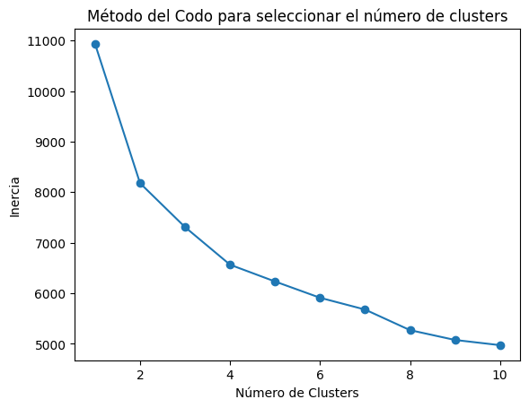
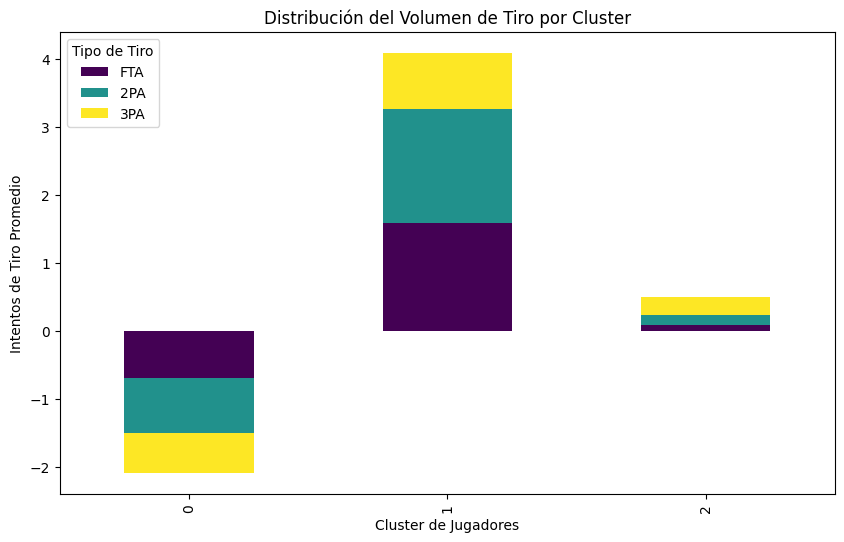
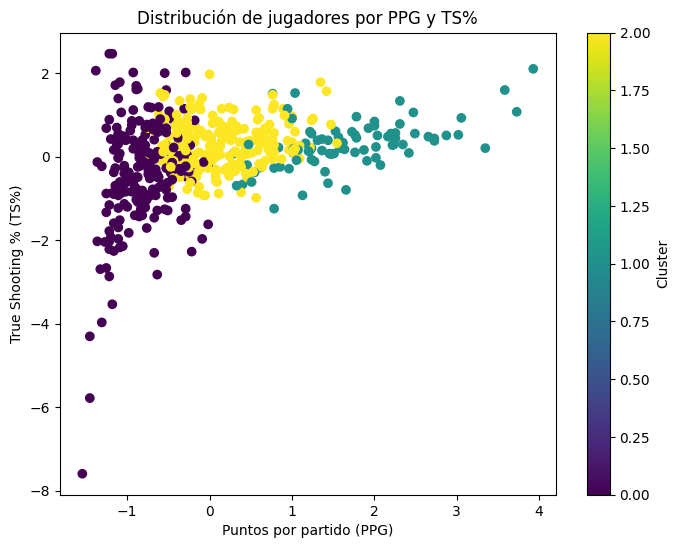
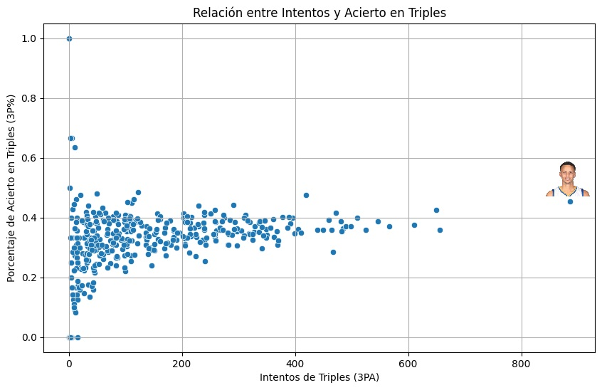
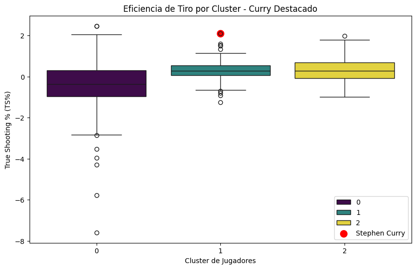

# 🏀 Análisis de Performance NBA 2015-16

## Resumen
Este proyecto aplica técnicas de **Aprendizaje No Supervisado** para segmentar a los jugadores de la NBA de la temporada 2015-16. El objetivo es identificar perfiles de juego basados en el volumen de tiro y la eficiencia, permitiendo distinguir entre jugadores de rol y estrellas de la liga mediante datos estadísticos.

## Metodología
Para asegurar un análisis riguroso, se siguieron los siguientes pasos:
1. **Limpieza y Normalización:** Procesamiento de estadísticas avanzadas con Pandas.
2. **Selección de Clusters:** Utilicé el **Método del Codo** para determinar que 3 era el número óptimo de agrupaciones, equilibrando la cohesión y la separación de los datos.

## Tecnologías Utilizadas
* **Python:** Pandas, Numpy.
* **Visualización:** Seaborn, Matplotlib.
* **Machine Learning:** Scikit-learn (K-Means & DBSCAN).
* **Entorno:** Google Colab.

## Análisis de Resultados
### 1. Perfiles Identificados
A través del clustering, logré segmentar la liga en tres grupos claros basados en su volumen de intentos (FTA, 2PA, 3PA).

### 2. Relación Puntos vs. Eficiencia
Al visualizar los clusters frente a los **Puntos por partido (PPG)** y el **True Shooting % (TS%)**, se observa una clara progresión de talento y efectividad.

## 🚀 Hallazgo Destacado: El Outlier Stephen Curry
El análisis permitió identificar casos excepcionales que rompen la norma estadística. Al cruzar el volumen de intentos de triples con el acierto, **Stephen Curry** aparece como un *outlier* absoluto.

Incluso dentro de su propio cluster de eficiencia, Curry se destaca como un valor atípico superior, como se observa en el análisis de distribución por cajas:

## Conclusión
El modelo logró transformar datos crudos en una segmentación deportiva coherente, validando que las métricas de eficiencia (TS%) son un diferenciador crítico para identificar a la élite de la NBA por encima del simple volumen de anotación.
